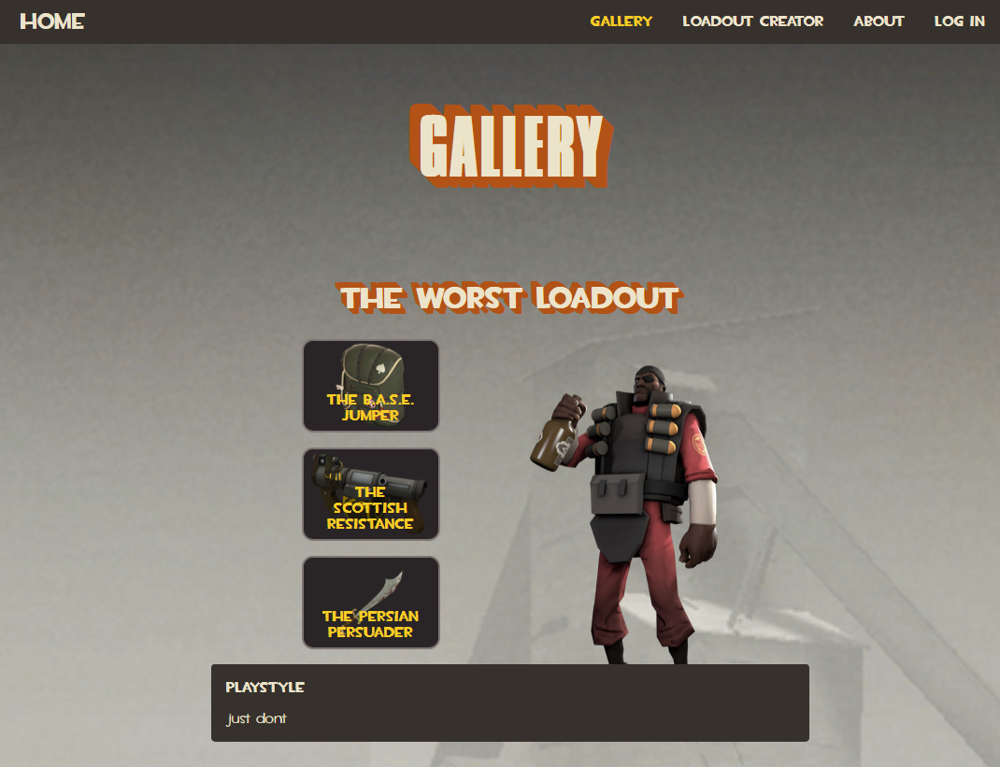

# tf2-subclass-creator
 
TF2 Subclass Creator (TF2SC) is a webapp for creating and exploring subclasses and loadouts from TF2, a popular hero shooter pioneer game made by Valve. 

Subclasses in TF2 refer to a unique set of weapons for a particular Mercenary. In addition to that, a subclass often comes with a unique playstyle that changes how you play the game.

Check out the [live demo](https://tf2sc.onrender.com/) to see TF2SC in action.

## Technologies used

TF2SC is a classic MEAN stack app, which means it uses:
- **MongoDB** - database to keep track of the weapons and loadouts
- **Express** - api to communicate between the frontend and database, and for additional processing
- **NodeJs** - used by both frontend and backend
- **Angular** - the frontend framework

In addition to that, it also uses:
- **Auth0** - for authentication
- **Angular Material** - for a nice responsive UI
- **Steam API** - to get the list of TF2 weapons

## Future plans

As of now, the app is finished. However, there are a few other elements I might consider adding in the future, such as:
- a guest user, so that anyone could experience the full app without the need for a login
- more filters, pagination or infinite scroll, to handle the case when thousands of loadouts are created

## Contributing

Contributions are welcome! Just open an issue or pull request.

